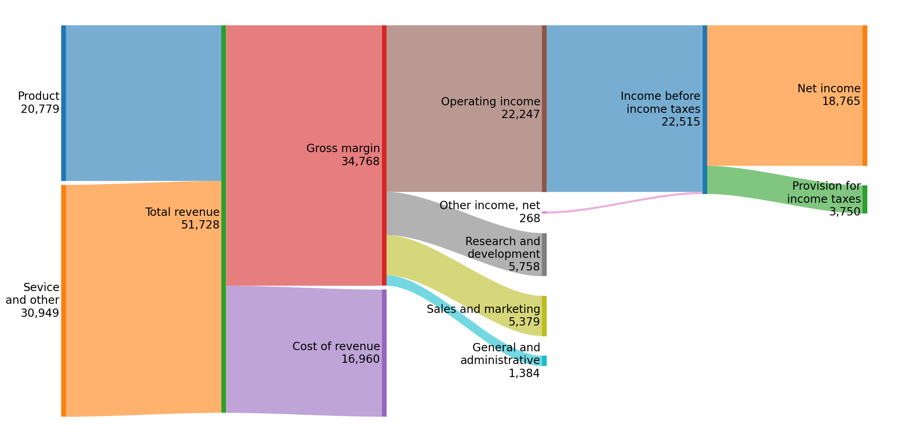
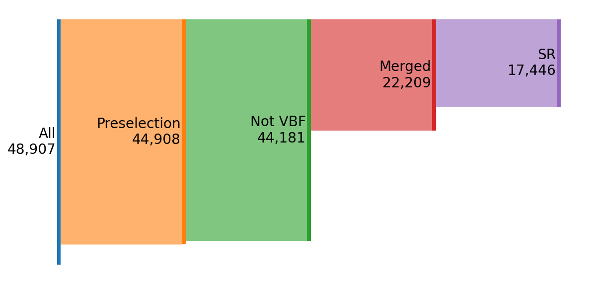
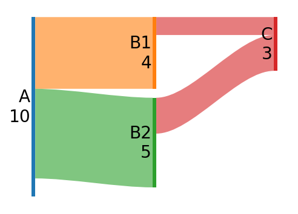
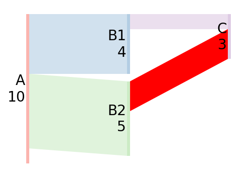
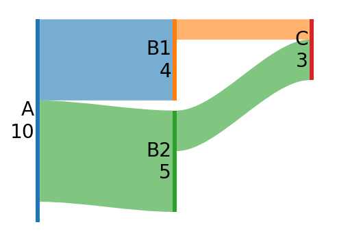
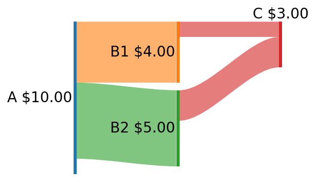
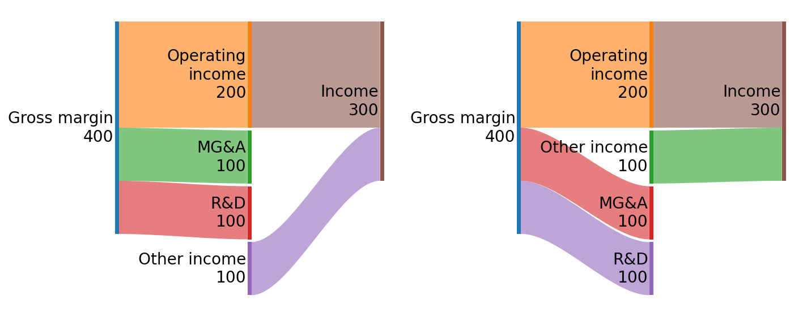

# SankeyFlow

SankeyFlow is a lightweight python package that plots [Sankey flow diagrams](https://en.wikipedia.org/wiki/Sankey_diagram) using Matplotlib.



```py
import matplotlib.pyplot as plt
from sankeyflow import Sankey

flows = [
    ('Product', 'Total revenue', 20779),
    ('Sevice and other', 'Total revenue', 30949),
    ('Total revenue', 'Gross margin', 34768),
    ('Total revenue', 'Cost of revenue', 16960),
    ...
]
s = Sankey(flows=flows)
s.draw()
plt.show()
```
See [example/msft_FY22q2.py](example/msft_FY22q2.py) for full example.

## Description

While Matplotlib does have a builtin sankey class, it is designed around single node flows. SankeyFlow instead focuses on directional flows, and looks more similar to plotly and [SankeyMATIC](https://sankeymatic.com/). It also treats nodes and flows separately, so the node value, inflows, and outflows don't have to be equal.



SankeyFlow is also fully transparent with Matplotlib; the sankey diagram requires only an axis to be drawn: `Sankey.draw(ax)`. All elements in the diagram are Matplotlib primitives (`Patch` and `Text`), and can be directly modified with the full suite of Matplotlib options.

## Installation

Requires Matplotlib and numpy.
```bash
python3 -m pip install sankeyflow
```
You can then simpliy
```py
from sankeyflow import Sankey
```

## Usage

The core class is `sankeyflow.Sankey`, which builds and draws the diagram. Data is passed in the constructor or with `Sankey.sankey(flows, nodes)`, and the diagram is drawn with `Sankey.draw(ax)`.

The diagram defaults to a left-to-right flow pattern, and breaks the nodes into "levels," which correspond to the x position. The cutflow diagram above has 5 levels, for example.

- `nodes` is a nested list of length `nlevels`, ordered from left to right. For each level, there is a list of nodes ordered from top to bottom. Each node is a `(name, value)` pair.
- `flows` is a list of flows, coded as `(source, destination, value)`. `source` and `destination` should match the `name`s in `nodes`.

If `nodes` is `None`, the nodes will be automatically inferred and placed from the flows.

```
nodes = [
    [('A', 10)],
    [('B1', 4), ('B2', 5)],
    [('C', 3)]
]
flows = [
    ('A', 'B1', 4),
    ('A', 'B2', 5),
    ('B1', 'C', 1),
    ('B2', 'C', 2),
] 

plt.figure(figsize=(4, 3), dpi=144)
s = Sankey(flows=flows, nodes=nodes)
s.draw()
```



### Configuration

Diagram and global configuration are set in the constructor. Individual nodes and flows can be further modified by adding a dictionary containing configuration arguments to the input tuples in `Sankey.sankey()`. See docstrings for complete argument lists. 

For example, we can change the colormap to pastel, make all flows not curvy, and change the color of one flow.
```py
flows = [
    ('A', 'B1', 4),
    ('A', 'B2', 5),
    ('B1', 'C', 1),
    ('B2', 'C', 2, {'color': 'red'}),
] 

s = Sankey(
    flows=flows,
    nodes=nodes,
    cmap=plt.cm.Pastel1,
    flow_opts=dict(curvature=0),
)
s.draw()
```



By default the color of the flows is the color of the destination node. This can be altered globally or per-flow with `flow_color_mode`. 
```py
flows = [
    ('A', 'B1', 4),
    ('A', 'B2', 5, {'flow_color_mode': 'dest'}),
    ('B1', 'C', 1),
    ('B2', 'C', 2),
] 

s = Sankey(
    flows=flows,
    nodes=nodes,
    flow_color_mode='source',
)
s.draw()
```



We can also easily adjust the label formatting and other node properties in the same way.
```py
nodes = [
    [('A', 10)],
    [('B1', 4), ('B2', 5)],
    [('C', 3, {'label_pos':'top'})]
]
flows = [
    ('A', 'B1', 4),
    ('A', 'B2', 5),
    ('B1', 'C', 1),
    ('B2', 'C', 2),
] 

s = Sankey(
    flows=flows,
    nodes=nodes,
    node_opts=dict(label_format='{label} ${value:.2f}'),
)
s.draw()
```



### Automatic Node Inference

Nodes can be automatically inferred from the flows by setting `nodes=None` in `Sankey.sankey()`. They are placed in the order they appear in the flows.

```py
gross = [
    ('Gross margin', 'Operating\nincome', 200),
    ('Gross margin', 'MG&A', 100), 
    ('Gross margin', 'R&D', 100), 
]
income = [
    ('Operating\nincome', 'Income', 200),
    ('Other income', 'Income', 100, {'flow_color_mode': 'source'}),
]

plt.subplot(121)
s1 = Sankey(flows=gross + income)
s1.draw()

plt.subplot(122)
s2 = Sankey(flows=gross[:1] + income + gross[1:])
s2.draw()

plt.tight_layout()
```



If you want to configure individual nodes while using the automatic inference, you can either access the nodes directly:
```py
s = Sankey(flows=flows)
s.find_node('name')[0].label = 'My label'
```
or retrieve the inferred nodes and edit the list before passing to `Sankey.sankey()`:
```py
nodes = Sankey.infer_nodes(flows)
# edit nodes
s.sankey(flows, nodes)
```
The latter is the only way to edit the ordering or level of the inferred nodes.